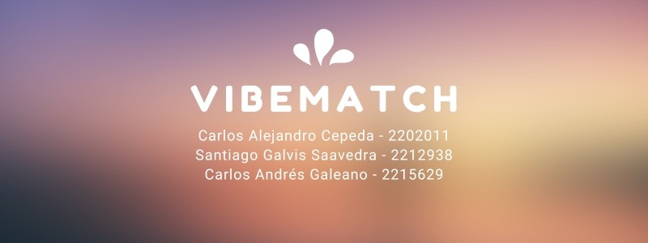

# Recomendación de musica IA (VibeMatch)

# Autores:
1. Carlos Alejandro Cepeda - 2202011
2. Santiago Galvis Saavedra - 2212938
3. Carlos Andrés Galeano - 2215629

# Objetivo:
Identificar y recomendar posibles exitos musicales usando diferentes modelos de IA en base a un dataset.

# Información del dataset:
Nuestro dataset fue extraido directamente de Kaggle, recopila las canciones más populares y escuchadas en Spotify en 2023, contando con un total de 954 filas y 24 columnas.
Enlace: https://www.kaggle.com/datasets/nelgiriyewithana/top-spotify-songs-2023

# Modelos utilizados en este proyecto:
1. Algoritmo genético
2. Modelo de regresión lineal
3. Random Forest
4. Red neuronal
5. Modelo PCA
6. DBSCAN

# Enlaces:
1. Diapositivas: https://www.canva.com/design/DAGhStqhT0c/dKqMW1aWa-LFF4MPVDucgQ/edit
2. Código: https://colab.research.google.com/drive/1m4gKZwry7-Emug-ycCCoSDKP84QDhhvA?usp=sharing#scrollTo=gPs9pHXyWHBk
3. Video: 
